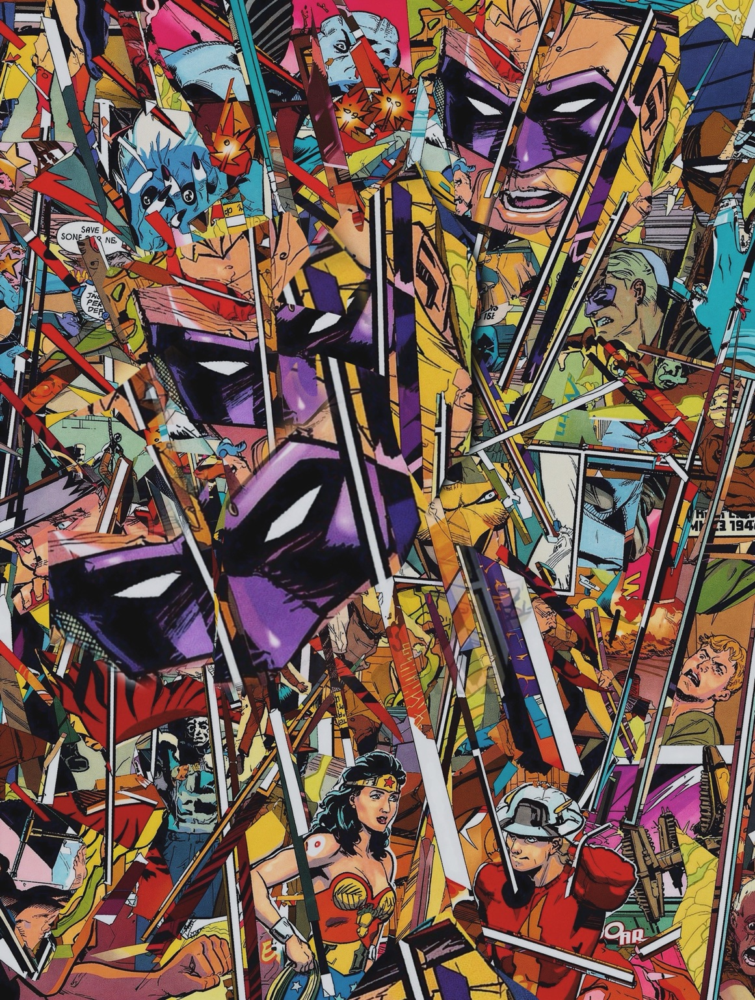
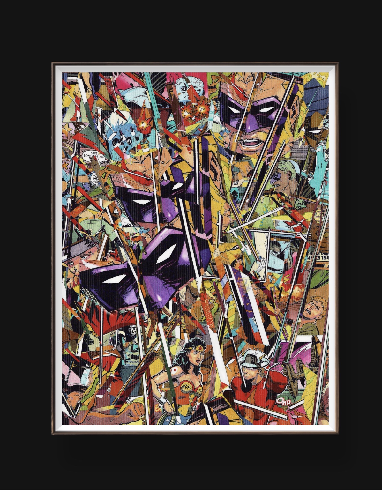

---
id: jsa-collage-fracture-event
type: object
title: "JSA Signal Fracture"
date: 2026-03-08
status: completed
visibility: public

medium:
  - comic collage
  - cut panel recomposition
  - mounted artwork
  - framed object

dimensions: comic page scale (mounted)

source_material:
  - Justice Society of America comic issue

themes:
  - signal collapse
  - heroic myth fragmentation
  - narrative compression
  - visual archaeology

excerpt: "Panels once separated by pages collide inside a single field. Sequential storytelling collapses into simultaneous signal."

media:
  - images/jsa-collage-fracture-close.jpg
  - images/jsa-collage-fracture-full.jpg

related:
  - jsa-collage-wip
  - codex-archive-system-v3
  - signal-harvest

bodyClass: prose
---

# JSA Signal Fracture

## Artifact Description

This object documents a completed collage assembled from fragments of a **Justice Society of America comic issue**.

Comic panels were physically cut, torn, and recombined into a dense visual surface.

Panels originally separated by page structure now collide within a single field.  
Sequential storytelling collapses into **simultaneous action**.

The original narrative order has been deliberately destroyed.

What remains is signal.

Edges remain visible and irregular to preserve the evidence of physical extraction.  
Layer height and surface reflection are retained as part of the object behavior.

The collage was mounted and framed following completion.

The frame functions as containment — holding the moment of fragmentation as a stable artifact.

---

## Visual Structure

The composition organizes itself into three observable zones.

### 1. Upper Field

A dense region of mechanical motion and explosive fragments.

Visible elements include:

- combat panels  
- machinery  
- impact bursts  
- character reactions  
- weapon fragments  

These fragments overlap and intersect, producing a sense of simultaneous action rather than readable sequence.

---

### 2. Central Axis

A repeated **purple mask fragment** forms a vertical spine through the composition.

Three stacked segments of the masked face align imperfectly.

The repeated white eye shapes act as a visual rhythm and focal anchor.

This axis behaves like a signal tower within the debris field.

---

### 3. Lower Field

The lower section contains the most legible character figures, including:

- a red-and-gold costumed heroine
- a helmeted soldier-like figure
- civilian and combat fragments

These figures appear surrounded by structural shards and weapon fragments.

They function less as narrative characters and more as **witnesses within the fractured signal field**.

---

## Structural Behavior

Thin diagonal strips and slivers traverse the composition.

These elements behave simultaneously as:

- shrapnel
- directional vectors
- structural scaffolding

Their orientation creates continuous visual motion across the surface.

The piece therefore reads not as a static collage but as a **captured explosion of narrative fragments**.

---

## Color System

The collage retains the saturated palette typical of late-20th-century comic printing:

- cadmium yellows
- deep purples
- bright reds
- cyan mechanical tones

Because the panels are aggressively fragmented, color becomes the primary organizing structure rather than original panel layout.

Clusters of color operate like geological strata across the surface.

---

## Material Substrate

The underlying board texture remains visible through the work.

Vertical grain lines appear across portions of the surface.

This substrate presence reinforces the object’s physical construction and prevents the collage from reading as a purely digital composition.

Materiality remains visible.

---

## Framed State

The artwork is presented within a white mat and frame.

This presentation changes the object’s reading:

The work no longer behaves as active cutting or process debris.

Instead it functions as a **contained event** — a preserved moment of visual rupture.

The frame acts as a boundary that holds the fragmentation in equilibrium.

---

## Artifact Images

### Surface Detail

---

### Framed Object

---

## Status

Completed object.

Future possibilities include:

- archival scan
- gallery display
- inclusion in a signal-fragment series
- expansion into a multi-panel collage system
